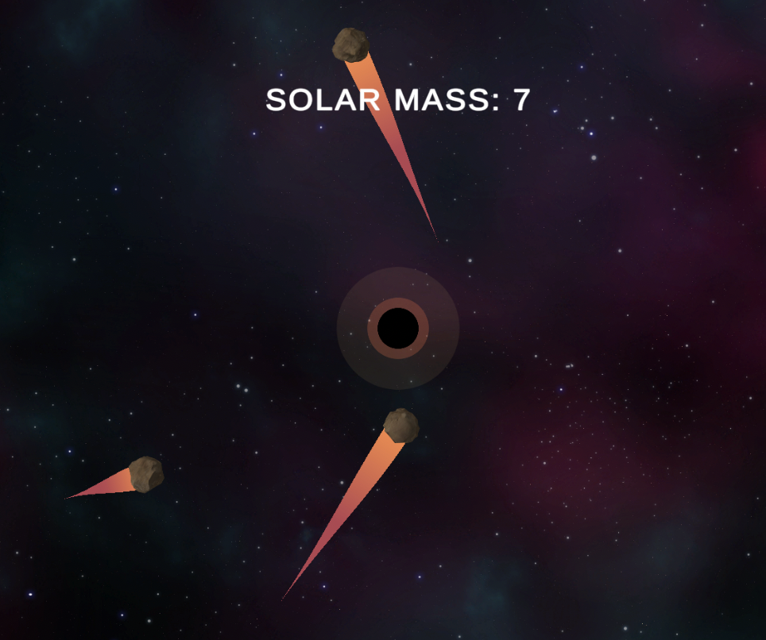

# Absorbable Universe

Introducing "Absorbable Universe", an engaging and educational game that transports players into the depths of space as they take on the role of a black hole. Experience the captivating journey of growing into the most massive black hole in the universe, while expanding your knowledge about the enigmatic phenomena of black holes and their gravitational influences.

In "Absorbable Universe", players will interact with asteroids by dragging them towards the black hole, altering their trajectories and ultimately, feeding the ever-hungry cosmic abyss. Our game offers an authentic representation of black hole physics, utilizing real-life calculations to accurately simulate the gravitational pull exerted on celestial bodies.

Embark on an extraordinary adventure that not only entertains but also enriches your understanding of the universe's most fascinating mysteries. Master the cosmic dance and become the ultimate gravitational force in "Cosmic Gravity"!

